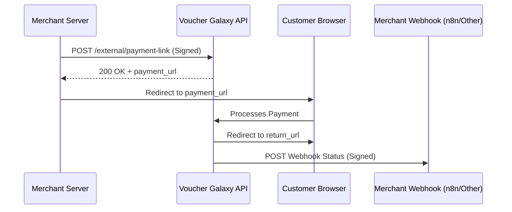

# Payment Link Integration Guide (v1.0)

This document provides complete instructions for integrating with the **Voucher Galaxy External Payment API**. This API allows third-party platforms to generate secure payment links for their users.

---

## 🚀 Overview

The payment link flow follows these steps:
1. **Request**: Your server sends a signed POST request to our API.
2. **Link**: Our API returns a unique `payment_url`.
3. **Checkout**: You redirect your user to the `payment_url`.
4. **Completion**: After payment, the user is redirected back to your `return_url`.
5. **Notification**: Our server notifies your `webhook_url` about the payment status.

### Workflow


---

## 🔐 Security & Request Signing

All requests must be authenticated using **HMAC-SHA256**. You must provide an `X-Signature` header in every request.

### Authentication Header
| Header | Description |
| :--- | :--- |
| `X-Signature` | HMAC-SHA256 hex digest of the JSON body using your API Secret Key. |

### How to Sign
The signature is generated by hashing the **exact JSON body string** (compact, no extra spaces) with your **External API Secret**.


---

## 📥 API Specification

### Endpoint
`POST https://api.vouchergalaxy.com/api/v1/external/payment-link`

### Request Body
| Field | Type | Req | Description |
| :--- | :--- | :--- | :--- |
| `phone_number` | string | ✅ | Customer phone in E.164 format (e.g., `+971500000000`) |
| `amount` | float | ✅ | Total amount to charge (e.g., `100.00`) |
| `currency` | string | ✅ | 3-letter currency code (e.g., `AED`, `USD`) |
| `reference_id` | string | ✅ | Your system's unique identifier (Order ID) |
| `return_url` | string | ❌ | URL to redirect user after payment completion |
| `webhook_url` | string | ❌ | URL to receive server-to-server status updates |

---

## 🛠️ Implementation Examples

````carousel
```python
# --- Python (requests) ---
import hmac, hashlib, json, requests

API_KEY = "YOUR_SECRET_API_KEY"
URL = "https://api.vouchergalaxy.com/api/v1/external/payment-link"

payload = {
    "phone_number": "+971501234567",
    "amount": 150.0,
    "currency": "AED",
    "reference_id": "ORD-12345",
    "return_url": "https://yoursite.com/success",
    "webhook_url": "https://yoursite.com/webhook"
}

# 1. Generate compact JSON
body = json.dumps(payload, separators=(',', ':'))

# 2. Sign the body
signature = hmac.new(API_KEY.encode(), body.encode(), hashlib.sha256).hexdigest()

# 3. Send request
response = requests.post(URL, data=body, headers={
    "Content-Type": "application/json",
    "X-Signature": signature
})

print(response.json())
```
<!-- slide -->
```javascript
// --- Node.js (axios) ---
const crypto = require('crypto');
const axios = require('axios');

const API_KEY = "YOUR_SECRET_API_KEY";
const URL = "https://api.vouchergalaxy.com/api/v1/external/payment-link";

const payload = {
    phone_number: "+971501234567",
    amount: 150.0,
    currency: "AED",
    reference_id: "ORD-12345",
    return_url: "https://yoursite.com/success"
};

const body = JSON.stringify(payload);
const signature = crypto.createHmac('sha256', API_KEY).update(body).digest('hex');

axios.post(URL, body, {
    headers: {
        'Content-Type': 'application/json',
        'X-Signature': signature
    }
}).then(res => console.log(res.data));
```
<!-- slide -->
```php
// --- PHP (curl) ---
<?php
$apiKey = "YOUR_SECRET_API_KEY";
$url = "https://api.vouchergalaxy.com/api/v1/external/payment-link";

$payload = [
    "phone_number" => "+971501234567",
    "amount" => 150.0,
    "currency" => "AED",
    "reference_id" => "ORD-12345"
];

$body = json_encode($payload);
$signature = hash_hmac('sha256', $body, $apiKey);

$ch = curl_init($url);
curl_setopt($ch, CURLOPT_POSTFIELDS, $body);
curl_setopt($ch, CURLOPT_HTTPHEADER, [
    "Content-Type: application/json",
    "X-Signature: $signature"
]);
curl_setopt($ch, CURLOPT_RETURNTRANSFER, true);
$response = curl_exec($ch);
curl_close($ch);

echo $response;
?>
```
````

---

## 📡 Webhook Verification

Our server will send status updates to your `webhook_url`. To ensure the webhook came from us, verify the signature.

1. Capture the raw request body.
2. Sign it using your `API_KEY`.
3. Compare it with the `X-Signature` header in the webhook request.

### Payload Schema
```json
{
  "order_id": "...",
  "status": "success",
  "amount": 150.0,
  "currency": "AED",
  "payment_id": "pi_...",
  "reference_id": "ORD-12345"
}
```

---

## 📋 cURL Demo

```bash
curl -X POST https://api.vouchergalaxy.com/api/v1/external/payment-link \
  -H 'Content-Type: application/json' \
  -H 'X-Signature: YOUR_GENERATED_SIGNATURE' \
  -d '{"phone_number":"+971501234567","amount":150.0,"currency":"AED","reference_id":"ORD-123","return_url":"https://yoursite.com/success","webhook_url":"https://yoursite.com/webhook"}'
```
